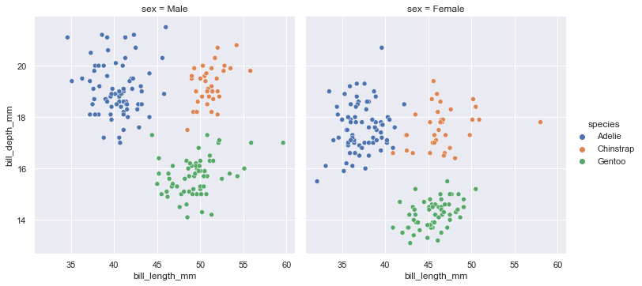
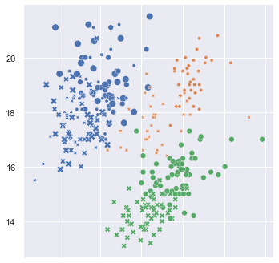
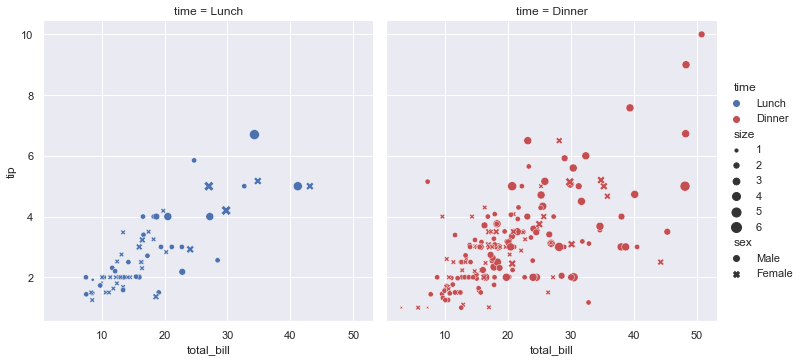
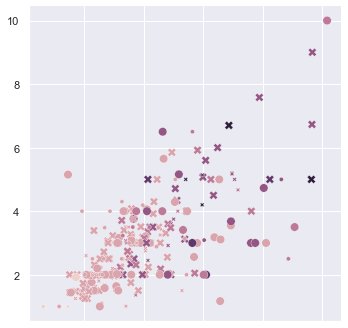
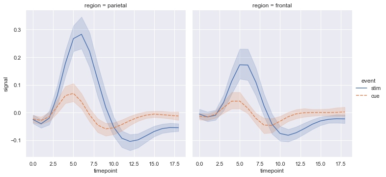
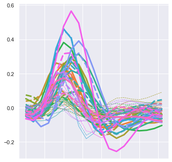

# aditiplot
Applies an Aditi filter to your plots for an improved clarity in your incredibly confusing multidimensional datasets.


## Example gallery


### A) Penguins dataset

```python
penguins = sns.load_dataset('penguins')
```


#### An inferior `seaborn` visualization

```python
g = sns.relplot(x='bill_length_mm',
                y='bill_depth_mm',
                hue='species',
                col='sex',
                data=penguins)
```


    

#### The superior `aditiplot`

```python
aditi.plot(penguins)
```


    

### B) Tips dataset

```python
tips = sns.load_dataset('tips')
```


#### An inferior `seaborn` visualization

```python
sns.relplot(
    data=tips, x="total_bill", y="tip", col="time",
    hue="time", size="size", style="sex",
    palette=["b", "r"], sizes=(10, 100)
);
```


    

#### The superior `aditiplot`

```python
aditi.plot(tips, hue='size');
```




### C) FMRI dataset

```python
fmri = sns.load_dataset('fmri')
```

#### An inferior `seaborn` visualization

```python
sns.relplot(
    data=fmri, x="timepoint", y="signal", col="region",
    hue="event", style="event", kind="line",
);
```
    


#### The superior `aditiplot`

```python
aditi.plot(fmri, kind='line');
```


