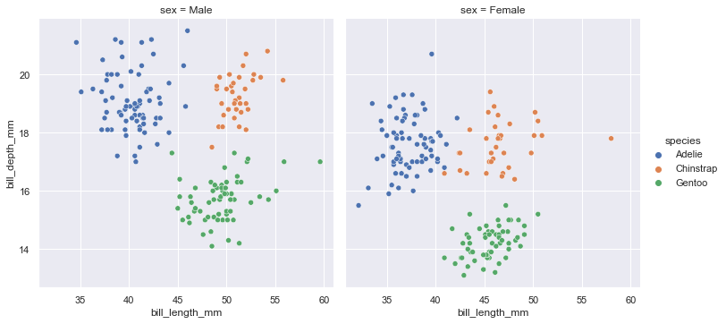
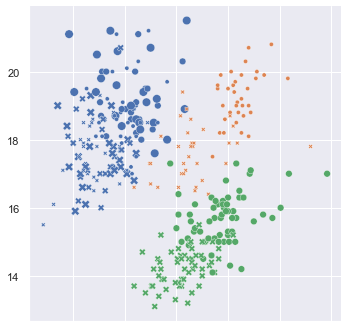

## `aditiplot` example gallery


```python
import matplotlib.pyplot as plt
import seaborn as sns

import aditiplot as aditi
```


```python
sns.set_theme(style='darkgrid')
```

### A) Penguins dataset


```python
penguins = sns.load_dataset('penguins')
penguins.sample(5)
```


<div>
<style scoped>
    .dataframe tbody tr th:only-of-type {
        vertical-align: middle;
    }

    .dataframe tbody tr th {
        vertical-align: top;
    }

    .dataframe thead th {
        text-align: right;
    }
</style>
<table border="1" class="dataframe">
  <thead>
    <tr style="text-align: right;">
      <th></th>
      <th>species</th>
      <th>island</th>
      <th>bill_length_mm</th>
      <th>bill_depth_mm</th>
      <th>flipper_length_mm</th>
      <th>body_mass_g</th>
      <th>sex</th>
    </tr>
  </thead>
  <tbody>
    <tr>
      <th>243</th>
      <td>Gentoo</td>
      <td>Biscoe</td>
      <td>46.3</td>
      <td>15.8</td>
      <td>215.0</td>
      <td>5050.0</td>
      <td>Male</td>
    </tr>
    <tr>
      <th>76</th>
      <td>Adelie</td>
      <td>Torgersen</td>
      <td>40.9</td>
      <td>16.8</td>
      <td>191.0</td>
      <td>3700.0</td>
      <td>Female</td>
    </tr>
    <tr>
      <th>227</th>
      <td>Gentoo</td>
      <td>Biscoe</td>
      <td>46.7</td>
      <td>15.3</td>
      <td>219.0</td>
      <td>5200.0</td>
      <td>Male</td>
    </tr>
    <tr>
      <th>77</th>
      <td>Adelie</td>
      <td>Torgersen</td>
      <td>37.2</td>
      <td>19.4</td>
      <td>184.0</td>
      <td>3900.0</td>
      <td>Male</td>
    </tr>
    <tr>
      <th>69</th>
      <td>Adelie</td>
      <td>Torgersen</td>
      <td>41.8</td>
      <td>19.4</td>
      <td>198.0</td>
      <td>4450.0</td>
      <td>Male</td>
    </tr>
  </tbody>
</table>
</div>


#### An inferior `seaborn` visualization


```python
g = sns.relplot(x='bill_length_mm',
                y='bill_depth_mm',
                hue='species',
                col='sex',
                data=penguins)
```


    

    


#### The superior `aditiplot`


```python
aditi.plot(penguins)
```


    <seaborn.axisgrid.FacetGrid at 0x218493dcbb0>


    

    


### B) Tips dataset


```python
tips = sns.load_dataset('tips')
tips.sample(5)
```


<div>
<style scoped>
    .dataframe tbody tr th:only-of-type {
        vertical-align: middle;
    }

    .dataframe tbody tr th {
        vertical-align: top;
    }

    .dataframe thead th {
        text-align: right;
    }
</style>
<table border="1" class="dataframe">
  <thead>
    <tr style="text-align: right;">
      <th></th>
      <th>total_bill</th>
      <th>tip</th>
      <th>sex</th>
      <th>smoker</th>
      <th>day</th>
      <th>time</th>
      <th>size</th>
    </tr>
  </thead>
  <tbody>
    <tr>
      <th>42</th>
      <td>13.94</td>
      <td>3.06</td>
      <td>Male</td>
      <td>No</td>
      <td>Sun</td>
      <td>Dinner</td>
      <td>2</td>
    </tr>
    <tr>
      <th>74</th>
      <td>14.73</td>
      <td>2.20</td>
      <td>Female</td>
      <td>No</td>
      <td>Sat</td>
      <td>Dinner</td>
      <td>2</td>
    </tr>
    <tr>
      <th>107</th>
      <td>25.21</td>
      <td>4.29</td>
      <td>Male</td>
      <td>Yes</td>
      <td>Sat</td>
      <td>Dinner</td>
      <td>2</td>
    </tr>
    <tr>
      <th>3</th>
      <td>23.68</td>
      <td>3.31</td>
      <td>Male</td>
      <td>No</td>
      <td>Sun</td>
      <td>Dinner</td>
      <td>2</td>
    </tr>
    <tr>
      <th>122</th>
      <td>14.26</td>
      <td>2.50</td>
      <td>Male</td>
      <td>No</td>
      <td>Thur</td>
      <td>Lunch</td>
      <td>2</td>
    </tr>
  </tbody>
</table>
</div>


#### An inferior `seaborn` visualization


```python
sns.relplot(
    data=tips, x="total_bill", y="tip", col="time",
    hue="time", size="size", style="sex",
    palette=["b", "r"], sizes=(10, 100)
);
```


    

    


#### The superior `aditiplot`


```python
aditi.plot(tips, hue='size');
```


    

    


### C) FMRI dataset


```python
fmri = sns.load_dataset('fmri')
fmri.sample(5)
```


<div>
<style scoped>
    .dataframe tbody tr th:only-of-type {
        vertical-align: middle;
    }

    .dataframe tbody tr th {
        vertical-align: top;
    }

    .dataframe thead th {
        text-align: right;
    }
</style>
<table border="1" class="dataframe">
  <thead>
    <tr style="text-align: right;">
      <th></th>
      <th>subject</th>
      <th>timepoint</th>
      <th>event</th>
      <th>region</th>
      <th>signal</th>
    </tr>
  </thead>
  <tbody>
    <tr>
      <th>910</th>
      <td>s0</td>
      <td>11</td>
      <td>cue</td>
      <td>parietal</td>
      <td>-0.039002</td>
    </tr>
    <tr>
      <th>457</th>
      <td>s9</td>
      <td>13</td>
      <td>stim</td>
      <td>frontal</td>
      <td>-0.075484</td>
    </tr>
    <tr>
      <th>198</th>
      <td>s12</td>
      <td>4</td>
      <td>stim</td>
      <td>parietal</td>
      <td>0.261283</td>
    </tr>
    <tr>
      <th>164</th>
      <td>s3</td>
      <td>7</td>
      <td>stim</td>
      <td>parietal</td>
      <td>0.390466</td>
    </tr>
    <tr>
      <th>181</th>
      <td>s11</td>
      <td>6</td>
      <td>stim</td>
      <td>parietal</td>
      <td>0.262771</td>
    </tr>
  </tbody>
</table>
</div>


#### An inferior `seaborn` visualization


```python
sns.relplot(
    data=fmri, x="timepoint", y="signal", col="region",
    hue="event", style="event", kind="line",
);
```


    

    


#### The superior `aditiplot`


```python
aditi.plot(fmri, kind='line');
```


    

    

